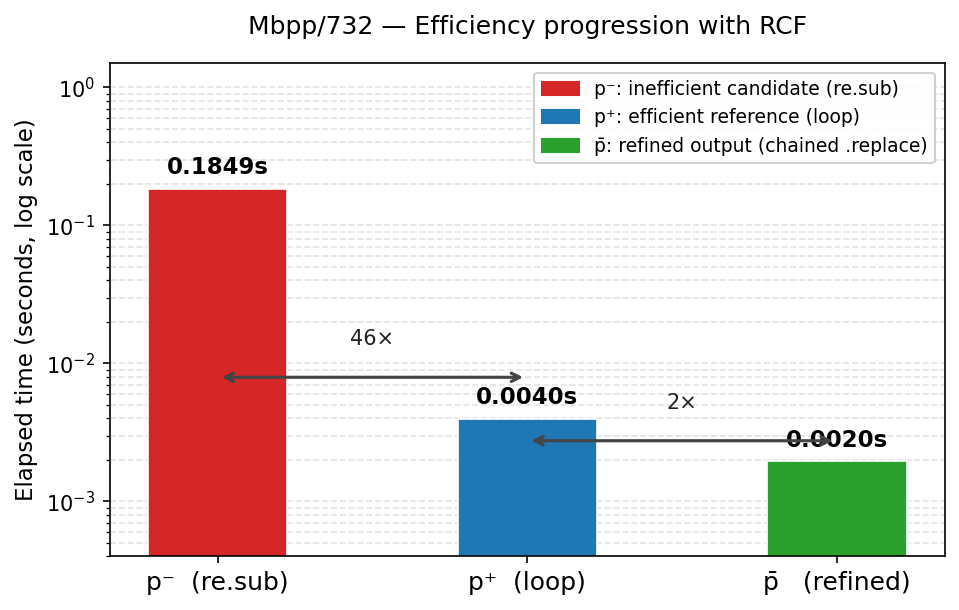

# EffiPair Case Study: Relative Contrastive Feedback (RCF)

This document responds to the reviewer request for a concrete example showing what
Relative Contrastive Feedback looks like and how informative it is.

---

## Task — Mbpp/732

> Write a function to replace all occurrences of spaces, commas, or dots with a colon.
>
> `assert replace_specialchar('Python language, Programming language.') == 'Python:language::Programming:language:'`

---

## Step 1 — Generation pool (Iteration 0)

The model generates N=3 candidates. All three pass correctness checks and profiling:

| Candidate | Code | Elapsed |
|-----------|------|---------|
| Generation 1 | `re.sub(r"[ ,\.]", ":", text)` | 0.1849 s |
| Generation 2 | loop over `[' ', ',', '.']` + `.replace()` | 0.0040 s |
| Generation 3 | chained `.replace(" ",":").replace(",",":").replace(".",":") ` | 0.0022 s |

EffiPair selects the pair for refinement according to the pairing strategy in §3.3:

- **p⁺** (efficient reference, `arg min e(p)`): the loop candidate — 0.0040 s
- **p⁻** (inefficient candidate, `arg max e(p)` among candidates with
  sim(p⁺, p⁻) ≥ τ): the `re.sub` candidate — 0.1849 s
  - Measured pair similarity: **0.886** (embed weight α=0.8, AST weight 0.2;
    embed similarity = 0.888, AST similarity = 0.877)

### p⁺ code and profile

```python
def replace_specialchar(text):
    for ch in [' ', ',', '.']:
        text = text.replace(ch, ':')
    return text
```

```
elapsed_time_sec=0.003981  max_footprint_mb=0.000
cpu=90.22%  |  text = text.replace(ch, ':')
```

### p⁻ code and profile

```python
import re

def replace_specialchar(text):
    return re.sub(r"[ ,\.]", ":", text)
```

```
elapsed_time_sec=0.184931  max_footprint_mb=0.000
cpu=94.63%  |  return re.sub(r"[ ,\.]", ":", text)
```

**Efficiency gap: 46×**

---

## Step 2 — RCF signal Δ(p⁺, p⁻)

EffiPair constructs the following prompt from the pair and their Scalene profiles
(~421 prompt tokens total for this call):

```
Guidance:
- Goal: preserve correctness first; optimize runtime second.
- Candidate A is faster and Candidate B performs worse.
- Candidate A elapsed time: 0.003981s; Candidate B elapsed time: 0.184931s.
- Try to improve efficiency only if correctness is maintained.
- You can use the difference between these two codes and their performance to learn
  which areas to improve.
- Do not sacrifice correctness for speed. If unsure, return Candidate A unchanged.
- Use the profiling hot lines to target real bottlenecks.
```

The signal is informative in two concrete ways:

1. **Direction**: it explicitly states which candidate is faster, rather than leaving
   the model to interpret a bare scalar.
2. **Localization**: the Scalene hot lines name `re.sub(...)` as the 95%-CPU line in
   p⁻ and `text.replace(ch, ':')` as the hot line in p⁺ — directly contrasting the
   two design choices responsible for the 46× gap.

---

## Step 3 — Refined output p̄

Given p⁺, p⁻, and Δ(p⁺, p⁻), the model produces:

```python
def replace_specialchar(text):
    return text.replace(" ", ":").replace(",", ":").replace(".", ":")
```

**Scalene profile (iter 2, after deduplication):**

```
elapsed_time_sec=0.001951  max_footprint_mb=0.000
```

The refined program is distinct from both inputs: it avoids the regex overhead
identified in p⁻ and eliminates the loop present in p⁺, achieving a
**2× speedup over p⁺** and a **~95× speedup over p⁻**.

---

## Summary figure



| Program | Code | Elapsed |
|---------|------|---------|
| p⁻ | `re.sub(r"[ ,\.]", ":", text)` | 0.1849 s |
| p⁺ | loop over `[' ', ',', '.']` + `.replace()` | 0.0040 s |
| p̄ (refined) | chained `.replace(" ",":").replace(",",":").replace(".",":") ` | **0.0020 s** |

The RCF signal communicated two things the model acted on: (1) that `re.sub` is the
bottleneck — named explicitly by the hot-line profile — and (2) that the
string-replacement strategy in p⁺ is the right direction. The model used this contrast
to produce a method-chain variant that improves on both inputs, an edit that would not
follow from absolute profiling of either program in isolation.
